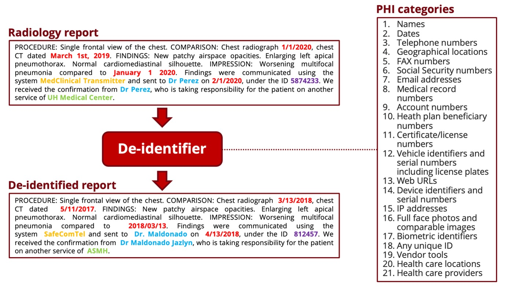

# Stanford & Penn & MIDRC Deidentifier



:hugs: Try out our model demo at https://huggingface.co/StanfordAIMI/stanford-deidentifier-base !

This deidentifier was developped on radiology reports to automate the de-identification process, before using the reports in a research project or sharing them with other teams or institutions. It was also tested on other types of clinical notes and demonstrated high performance, as underlined in the associated publication. The project is meant for research purposes only.

This project was made possible by MIDRC and part of **MIDRC CRP 1 - Natural language processing of radiology reports for COVID-19** (https://www.midrc.org/midrc-collaborating-research-projects/project-one-crp1).

**Development Team**: Pierre Chambon (Stanford University), Tessa S. Cook (Penn University), Curtis P. Langlotz (Stanford University).

# Getting the model running

```bat
foo@bar:~$ git clone https://github.com/MIDRC/Stanford_Penn_Deidentifier.git
foo@bar:~$ cd Stanford_Penn_Deidentifier
```

Then, make sure you are in a Python virtualenv or conda environment where torch is already installed: otherwise, follow the instructions of https://pytorch.org/.

```bat
foo@bar:~$ pip show torch
```

Once you can confirm that torch is installed, you can run the command:

```bat
foo@bar:~$ pip install -r requirements.txt
```

You should be set up to make the model work. To run the model on your own reports, you need to put the reports, represented as a python string array, in a .npy file. The deidentifier will put the deidentified reports in another .npy file, along a .csv file with more info that can be useful for a human review of the deidentified reports (prior to sharing or public release).

To run the model, you only need the command:

```bat
foo@bar:~$ python main.py [-h] --device_list DEVICE_LIST [DEVICE_LIST ...]
               [--num_workers NUM_WORKERS] [--num_cpu_processes NUM_CPU_PROCESSES]
               [--batch_size BATCH_SIZE] --input_file_path INPUT_FILE_PATH
               --output_file_path OUTPUT_FILE_PATH
               [--hospital_list HOSPITAL_LIST [HOSPITAL_LIST ...]]
               [--vendor_list VENDOR_LIST [VENDOR_LIST ...]]
```

As an example, you could run:

```bat
foo@bar:~$ python main.py --input_file_path ./reports_stanford.npy --output_file_path ./reports_stanford_deidentified.npy --device cuda:0 cuda:1 cuda:2 --hospital_list stanford washington
```

# Generating good-looking synthetic PHI

The hide-in-plain-sight algorithm generates synthetic PHI in-place of the original and detected PHI. To do so, it relies on data sets of PHI examples, for each category. This repo contains the data files for each category but with very limited data in them. You can either modify them manually, and insert whatever examples of names or hospitals you wish, or rely on the following online resources to get good data sets of synthetic PHI:

- Surnames. Go to https://www.census.gov/topics/population/genealogy/data/2000_surnames.html and download "File B: Surnames Occurring 100 or more times". Then rename the file as "Common_Surnames_Census_2000.csv" and replace the existing file of this repo, already named "Common_Surnames_Census_2000.csv", with this new file. 

- Firstnames. Go to https://data.world/len/us-first-names-database/workspace/file?filename=SSA_Names_DB.xlsx and download the file "SSA_Names_DB.xlsx". Then replace the existing file of this repo, already named "SSA_Names_DB.xlsx", with this new file. 

- Vendors/Companies. You can find good examples at https://golden.com/list-of-healthcare-companies/ and then insert them in the file "companies.txt".

- Hospitals. You can find good examples at https://www.hospitalsafetygrade.org/all-hospitals and then insert them in the file "hospitals.txt".

- Universities. You can find good examples at https://en.wikipedia.org/wiki/Lists_of_American_universities_and_colleges and then insert them in the file "universities.txt".

# References

```bibtex
@article{10.1093/jamia/ocac219,
    author = {Chambon, Pierre J and Wu, Christopher and Steinkamp, Jackson M and Adleberg, Jason and Cook, Tessa S and Langlotz, Curtis P},
    title = "{Automated deidentification of radiology reports combining transformer and “hide in plain sight” rule-based methods}",
    journal = {Journal of the American Medical Informatics Association},
    year = {2022},
    month = {11},
    abstract = "{To develop an automated deidentification pipeline for radiology reports that detect protected health information (PHI) entities and replaces them with realistic surrogates “hiding in plain sight.”In this retrospective study, 999 chest X-ray and CT reports collected between November 2019 and November 2020 were annotated for PHI at the token level and combined with 3001 X-rays and 2193 medical notes previously labeled, forming a large multi-institutional and cross-domain dataset of 6193 documents. Two radiology test sets, from a known and a new institution, as well as i2b2 2006 and 2014 test sets, served as an evaluation set to estimate model performance and to compare it with previously released deidentification tools. Several PHI detection models were developed based on different training datasets, fine-tuning approaches and data augmentation techniques, and a synthetic PHI generation algorithm. These models were compared using metrics such as precision, recall and F1 score, as well as paired samples Wilcoxon tests.Our best PHI detection model achieves 97.9 F1 score on radiology reports from a known institution, 99.6 from a new institution, 99.5 on i2b2 2006, and 98.9 on i2b2 2014. On reports from a known institution, it achieves 99.1 recall of detecting the core of each PHI span.Our model outperforms all deidentifiers it was compared to on all test sets as well as human labelers on i2b2 2014 data. It enables accurate and automatic deidentification of radiology reports.A transformer-based deidentification pipeline can achieve state-of-the-art performance for deidentifying radiology reports and other medical documents.}",
    issn = {1527-974X},
    doi = {10.1093/jamia/ocac219},
    url = {https://doi.org/10.1093/jamia/ocac219},
    note = {ocac219},
    eprint = {https://academic.oup.com/jamia/advance-article-pdf/doi/10.1093/jamia/ocac219/47220191/ocac219.pdf},
}
```
